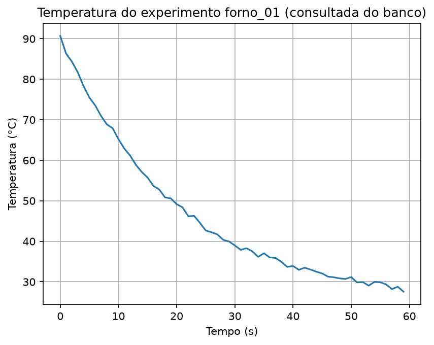

# P02 — Banco de dados de experimentos físicos

Status: ✅ Concluído

## Sinopse
Todo laboratório ou fábrica gera dados de experimentos que precisam ser armazenados e consultados. Este projeto usa um banco de dados SQLite para registrar experimentos físicos simulados — medições de temperatura, pressão e corrente elétrica ao longo do tempo — e explora como estruturar tabelas, inserir dados e fazer consultas com filtros e agregações.

## Dataset
Nenhum dataset externo — os dados são gerados por simulação (reaproveitando os fenômenos físicos do P01: resfriamento de Newton, oscilação com ruído, e um motor elétrico partindo) e armazenados num banco SQLite local.

## O que foi construído
1. Um banco de dados SQLite (`data/experimentos.db`) com uma tabela `medicoes` em formato longo (uma linha por leitura: experimento, tempo, sensor, valor).
2. Geração e inserção de medições simuladas de dois experimentos (`forno_01` e `motor_02`), com 3 sensores cada.
3. Consultas SQL com filtro (`WHERE`) e agregação (`GROUP BY`, `AVG`, `MIN`, `MAX`), lidas diretamente em `pandas`.
4. Uma reflexão sobre como esse mesmo modelo escalaria num ambiente industrial real, usando bancos de dados na nuvem (AWS RDS / Google Cloud SQL).

### Temperatura consultada do banco

## O que este projeto trouxe
- Criar e estruturar tabelas com `sqlite3` (biblioteca padrão do Python, sem instalação).
- Diferença entre `execute()` (roda o comando) e `commit()` (grava de forma permanente).
- Inserção em lote com `executemany()` e consultas parametrizadas (`?`), evitando escrever valores direto na string SQL.
- Um gotcha real de bancos de dados: `INSERT` sempre soma, nunca substitui — rodar a mesma célula várias vezes duplica dados, a menos que a limpeza seja feita explicitamente.
- Usar `pandas.read_sql_query` para trazer o resultado de uma consulta SQL direto como tabela, unindo bancos de dados com análise de dados.

## Próximo passo
**P03 — Explorando dados de sensores industriais**: primeiro contato com um dataset público real (Kaggle/UCI), aplicando o que já foi aprendido sobre estruturar e consultar dados de sensores.

## Estrutura
- `notebooks/` — notebook Jupyter (VSCode) deste projeto: [`P02_banco_experimentos.ipynb`](notebooks/P02_banco_experimentos.ipynb)
- `data/` — banco de dados SQLite gerado (fica de fora do Git, veja `.gitignore`)
- `images/` — gráficos exportados pelo notebook, usados neste README
