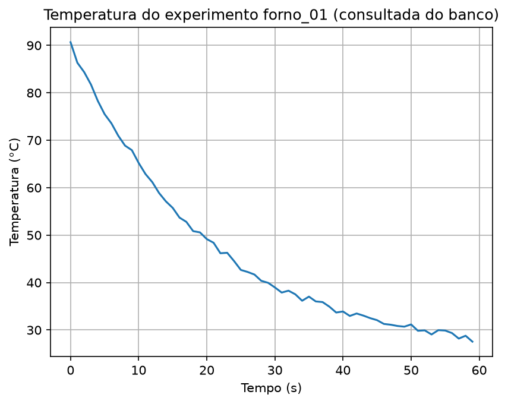

# P02. Banco de dados de experimentos físicos

**Nº 2 de 48 na ordem de execução.** ID do projeto: P02.

**Cursos da Alura a fazer antes deste projeto (todos os que caem aqui na ordem das 4 carreiras):**
- CD/Base-04 a 06 - SQL no SQLite: instruções, consultas, projeto base

Todo laboratório ou fábrica gera dados de experimentos que precisam ser guardados e consultados. Este
projeto usa um banco SQLite para registrar experimentos físicos simulados (temperatura, pressão e
corrente elétrica ao longo do tempo) e explora como estruturar tabelas, inserir dados e consultar com
filtros e agregações.

## Os dados

Não há dataset externo. Os dados são simulados, reaproveitando os fenômenos do projeto 1 (resfriamento
de Newton, oscilação com ruído e um motor elétrico partindo), e ficam num banco SQLite local.

## O que foi feito

Um banco SQLite (`data/experimentos.db`) com uma tabela `medicoes` em formato longo, uma linha por
leitura (experimento, tempo, sensor, valor). Medições simuladas de dois experimentos (`forno_01` e
`motor_02`), com 3 sensores cada, inseridas em lote. Consultas SQL com filtro (`WHERE`) e agregação
(`GROUP BY`, `AVG`, `MIN`, `MAX`), lidas direto em `pandas`. E uma nota sobre como o mesmo modelo
escalaria numa fábrica real, com bancos na nuvem (AWS RDS, Google Cloud SQL).



## O que ficou

O `sqlite3` vem com o Python, sem instalação. `execute()` roda o comando e `commit()` grava de forma
permanente. `executemany()` insere em lote, e as consultas parametrizadas (`?`) evitam escrever valores
direto na string SQL. Um detalhe importante: `INSERT` sempre soma, nunca substitui, então rodar a mesma
célula várias vezes duplica os dados se a limpeza não for feita de forma explícita. Por fim,
`pandas.read_sql_query` traz o resultado de uma consulta direto como tabela.

## Como rodar

```bash
pip install pandas matplotlib jupyter
jupyter notebook notebooks/P02_banco_experimentos.ipynb
```

O banco é criado pelo próprio notebook em `data/experimentos.db` (fica de fora do Git, ver `.gitignore`).

O próximo projeto usa um dataset público real de sensores, com o que foi visto aqui sobre estruturar e
consultar dados.
